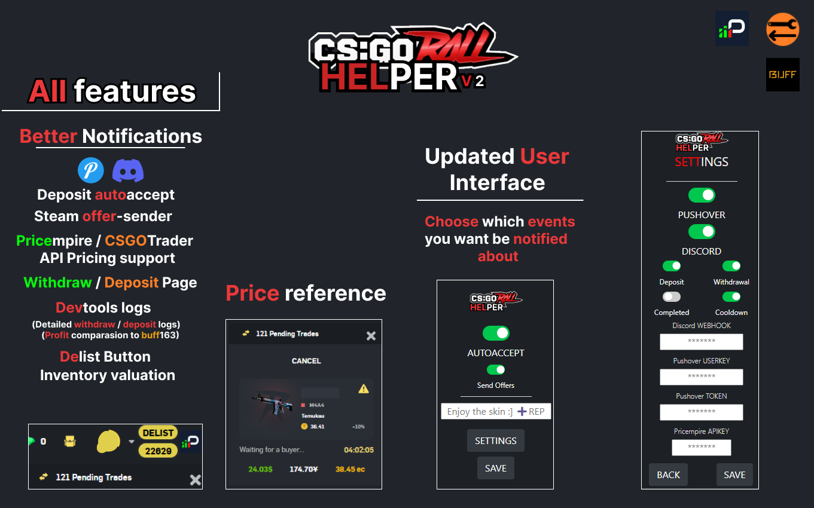
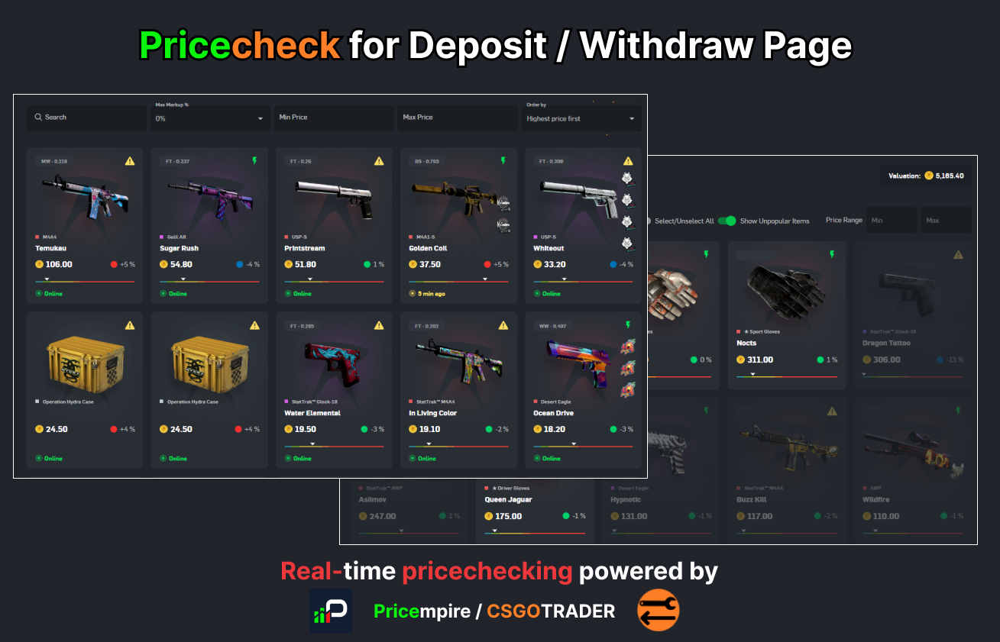

# ROLLHELPER

**RollHELPER** is chrome extension dedicated for the **csgoroll trading
community**. It offers various functions which aim to help with trading on
csgoroll.

> **NOTICE**: Since the the support for csgotrader pricing api has been
> discontinued the extension offers no free in-built pricing option as of right
> now. (So you might want to support Pricempire :] )

## Current Features

- Deposit autoaccept
- Automatic steam offer sending
  - Custom offer message option
- RealTime pricing provided by Pricempire (_Subscription needed_)
- Pricing for Depo / Withdraw page
- Notifications providers
  - Pushover (_recommended_)
  - Discord
- Notifications for every trade event
  - Deposit
  - Withdraw
  - Cooldown
- Detailed logs in devtools console
  - Pricing
  - Item details
  - Buff163 USD price reference
  - Max markups
  - BUFF163 redirect link
- Delist button
- Total inventory value display (_coins_)
- Depo panel price reference

### PRICING

I tried to make pricing as much accurate as possible but keep in mind that some
items might be priced slightly differently for various reasons, but for the
most, the pricing should be somewhat accurate.

### Steam offer sender

RollHELPER is using csgotrader's extension feature which has to be enabled  
in order to work properly (_turn on "**Send offers based on query params"**,
**"Select item based on query params (autofill)"** and **Tabs API access** _).

> **NOTICE:** I, nor anyone who has been ever using this feature for a rather
> longer period of time now, has never experienced any erros while sending the
> offers, I however have to warn you to use this feature on your own risk (if
> you are using automated steam confirmations), and always make sure to check if
> correct item has been sent.

### LOGS

> If you plan on using logs (F12), I suggest you to set your devtools display
> only to 'Info' so you wont get spammed by useless csgoroll errors  >
> 

## Showcase

## Installation

#### GIT:

`git clone https://github.com/0xM14N/rollhelper-extension`

#### Zip download:

> **DOWNLOAD:** Click green code button with arrow -> Download ZIP -> unzip the
> files somewhere

1. Go to chrome://extensions
2. Make sure 'Developer Mode' option is turned on (upper right corner)
3. Click 'Load unpacked'
4. Select and upload the extension file you unzipped (rollhelper-extension)

### Issues

Iam aware that the extension has a lot of bugs / issues, so feel free to open
github issue if you find any
