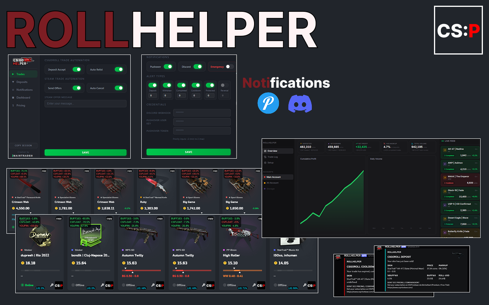

# RollHelper - Trading extension for csgoroll

<div align="center">



**The Chrome extension for CS2 traders on CSGORoll**

[](https://www.gnu.org/licenses/gpl-3.0)
[](https://chrome.google.com/)
[](https://csgoroll.com/r/RLHLPR)

*Streamline your trading workflow with automation, real-time pricing, and with notifications*

</div>

# Recent Changes

## v1.2.2 - 2026-01-05

### ✨ Added
- Session Cookie extractor (main popup)
- Pushover notifications priority settings for trade events
- Added youpin prices into the pricing overlay

### 🔧 Changed
- Improved in-site pricing overlay for better visibility


### 🐛 Fixed
- Minor issues with logs formatting / notifications
- Connection from other domains (.gg / tr.com)
- Protected event notification coins value fix

##  Table of Contents

- [Overview](#-overview)
- [Key Features](#-key-features)
- [Installation](#-installation)
- [Configuration](#-configuration)
- [Pricing Integration](#-pricing-integration-cspricebase)
- [Notifications Setup](#-notifications-setup)
- [Usage Guide](#-usage-guide)
- [FAQ](#-faq)
- [Support](#-support)
- [License](#-license)

---

## 🎯 Overview

**RollHelper** is a Chrome extension designed specifically for CS2 traders on CSGORoll. It automates tedious tasks, provides real-time market pricing, and keeps you informed of all trading events through multiple notification channels.

Whether you're a casual trader or running a high-volume operation, RollHelper streamlines your workflow and helps you make informed trading decisions.

### Why RollHelper?

- **⚡ Lightning-Fast Automation** - Accept deposits and send Steam offers instantly
- **💰 Real-Time Pricing** - Live market data from CSPRICEBASE API
- **🔔 Multi-Channel Notifications** - Discord & Pushover integration
- **📊 Detailed Analytics** - Console logs with pricing insights
- **🎨 Clean Interface** - Non-intrusive UI that enhances CSGORoll

---

## ✨ Key Features

### 🤖 Trading Automation

#### Automatic Deposit Accept
Instantly accept incoming deposits without manual intervention. Perfect for high-volume traders who need to process trades quickly.

#### Smart Steam Offer Sending
Automatically generates and sends Steam trade offers with:
- Optional custom messages for personalization
- Integration with CSGOTrader extension for seamless sending
- Intelligent item selection and verification

### Pricing System

#### CSPRICEBASE Integration
Access pricing data for CS2 items:
- **Real-time market prices** from multiple marketplaces
- **Comparative analysis** showing price differences across platforms
- **Fast database lookups** for instant pricing information
- **Markup injection** directly into marketplace interfaces

#### Pricing Display Features
- Item prices on Deposit/Withdraw pages
- Buff163, CSFLOAT, YOUPIN price comparisons

### 📱 Comprehensive Notifications

Stay informed of all trading activities through:

#### Discord Notifications
- Real-time webhook integration
- Detailed trade event information
- Custom formatting and embeds

#### Pushover Notifications *(Recommended)*
- Priority notification delivery
- Mobile push notifications
- Custom sounds and alerts

#### Supported Events
- ✅ **Deposits** - When items are deposited to your account
- 📤 **Withdrawals** - When you withdraw items
- ⏰ **Cooldowns** - Trade cooldown notifications

### 🔍 Developer Tools Integration

#### Console Logging System
Detailed trade information logged to browser console:
- Complete item details and specifications
- Real-time pricing data
- Buff163, CSFloat, YOUPIN price references
- Maximum markup calculations
- Direct links to CSP pricing database
- Trade history and timestamps

*Pro Tip: Set your DevTools to 'Info' level to filter out CSGORoll noise*


## 📦 Installation

### Prerequisites

- Google Chrome or Chromium-based browser
- [CSGOTrader Extension](https://csgotrader.app/) (for Steam offer automation)
- Active CSGORoll account

### Step-by-Step Guide

#### Option 1: Git Clone (Recommended)

```bash
git clone https://github.com/0xM14N/rollhelper-extension.git
cd rollhelper-extension
```

#### Option 2: Direct Download

1. Visit the [GitHub repository](https://github.com/0xM14N/rollhelper-extension)
2. Click the green **"Code"** button
3. Select **"Download ZIP"**
4. Extract the archive to a permanent location

### Loading the Extension

1. Open Chrome and navigate to `chrome://extensions`
2. Enable **"Developer mode"** (toggle in top-right corner)
3. Click **"Load unpacked"**
4. Select the `rollhelper-extension` folder
5. The extension icon should appear in your toolbar

### Post-Installation Setup

#### Configure CSGOTrader Integration

For automatic Steam offer sending to work properly:

1. Open CSGOTrader extension settings
2. Enable the following options:
  - ✅ **"Send offers based on query params"**
  - ✅ **"Select item based on query params (autofill)"**
  - ✅ **"Tabs API access"**
3. Save settings

> **⚠️ Important Notice:** While this feature has been thoroughly tested and used by many traders without issues, always verify that the correct items are being sent, especially when using automated Steam confirmations. Use at your own discretion.

---

## ⚙️ Configuration

### Extension Settings

Access settings by clicking the RollHelper icon in your toolbar:

1. **Automation Settings**
  - Toggle automatic deposit accepts
  - Configure offer message templates

2. **Notification Preferences**
  - Select notification channels (Discord/Pushover)
  - Configure webhook URLs
  - Set notification triggers

3. **Display Options**
  - Toggle pricing displays
---

## 💰 Pricing Integration (CSPRICEBASE)

RollHelper's pricing features are powered by [CSPRICEBASE.com](https://cspricebase.com), providing accurate, real-time market data across multiple CS2 trading platforms.

### Getting Your CSPRICEBASE Subscription

#### Step 1: Create an Account

1. Visit [CSPRICEBASE.com](https://cspricebase.com)
2. Click **"Sign Up"** or **"Register"**
3. Complete the registration form with:
  - Valid email address
  - Secure password
  - Account details
4. Verify your email address

#### Step 2: Choose a Subscription Plan

1. Log into your CSPRICEBASE account
2. Get subscription that gives you access to the CSP DB

#### Step 3: Complete Payment

1. Your subscription becomes valid instantly after completing payment

#### Step 4: Get Your API Key

1. After successful payment, go to **"PROFILE"** 
2. Click **"Generate API Key"**
3. Copy your API key

#### Step 5: Configure RollHelper

1. Open RollHelper extension settings
2. Navigate to **"Pricing"**
3. Paste your CSPRICEBASE API key
4. Save settings

### Pricing Features Overview

Once configured, you'll have access to:

- **Comparative Pricing** - See prices across CSGORoll, Buff163
- **Profit Margins** - Calculate potential profits instantly
- **Database Lookups** - Fast pricing queries for any CS2 item

---

## 🔔 Notifications Setup

### Discord Integration

#### Creating a Webhook

1. Open your Discord server
2. Go to **Server Settings** → **Integrations** → **Webhooks**
3. Click **"New Webhook"**
4. Customize:
  - Name: "RollHelper Bot"
  - Channel: Select notification channel
  - Avatar: Upload custom icon (optional)
5. Click **"Copy Webhook URL"**
6. Paste into RollHelper settings under **Discord Webhook URL**

#### Discord Notification Format


### Pushover Integration

#### Setting Up Pushover

1. Visit [Pushover.net](https://pushover.net) and create an account
2. Install Pushover app on your mobile device(s)
3. Log into the website and navigate to your dashboard
4. Note your **User Key** (format: `uxxxxxxxxxxxxxxxxxxxxxxx`)
5. Create a new application:
  - Click **"Create an Application/API Token"**
  - Name: "RollHelper"
  - Type: Application
  - Description: "CSGORoll trading notifications"
6. Save and copy your **API Token**


### Notification Events

Configure which events trigger notifications:

- **Deposit Events**
  - ✅ Deposit accepted

- **Withdrawal Events**
  - ✅ Withdrawal initiated

- **Trade Cooldowns**
  - ✅ Item cooldown started
---

## 📖 Usage Guide


### Console Logging

Open Developer Tools (F12) to access detailed trade information:

```
[15:03] | [WITHDRAW - ACCEPTED]
Glock-18 | Glockingbird (Minimal Wear)
9.73 coins | (0%) | 6.4218$
[LIQ]: 50% | [MAX MARKUP]: 12%
[BUFF163_%]: +3.2%
[CSFLOAT_%]: +3%
[YOUPIN_%]: +2%
```


#### Security Recommendations

- Never share your API keys or webhook URLs
- Double-check trades manually
- Keep the extension updated to the latest version
- Review trade history regularly

---

## ❓ FAQ

### General Questions

**Q: Is RollHelper free to use?**  
A: Yes, the extension itself is completely free and open-source. However, pricing features require a CSPRICEBASE subscription.

**Q: What if I need more features in my rollhelper?**  
A: I currenty offer premium version of rollhelper aswell, this includes features as: Automatic steam token renew, Always-online store or any other custom features you might need. For more info contact me on discord (maintrades)


**Q: Does this violate CSGORoll's Terms of Service?**  
A: RollHelper is designed to enhance the trading experience without providing unfair advantages. Always review CSGORoll's current ToS. Use at your own discretion.

**Q: Will this work on other CS2 trading sites?**  
A: Currently, RollHelper is specifically designed for CSGORoll. Support for other platforms may be added in future versions.

### Technical Questions

**Q: Why isn't automatic Steam offer sending working?**  
A: Ensure you've properly configured CSGOTrader extension settings and enabled all required permissions.

**Q: Pricing data isn't showing up?**  
A: Verify your CSPRICEBASE API key is valid and your subscription is active. Check the connection in settings.

**Q: Can I use this on multiple devices?**  
A: Yes! Install on each device and use the same API keys/webhooks for consistent notifications.

**Q: How do I update the extension?**  
A: For git installations, run `git pull`. For zip downloads, download the latest release and replace files.

### Troubleshooting

**Q: Extension isn't loading on CSGORoll?**  
A: Refresh the page, check that the extension is enabled in `chrome://extensions`, and verify permissions are granted.

**Q: Notifications stopped working?**  
A: Check your Discord webhook URL or Pushover tokens. Test the connection in settings.

**Q: Console is showing errors?**  
A: Set Developer Tools to "Info" level to filter CSGORoll errors. If RollHelper errors persist, report them on GitHub.

---

## 🆘 Support

### Getting Help

- **GitHub Issues**: [Report bugs or request features](https://github.com/0xM14N/rollhelper-extension/issues)
- **Discord**: Contact `maintrades` for direct support
- **Documentation**: Check this README for detailed guidance

### Reporting Bugs

When reporting issues, please include:

1. Chrome version and OS
2. Extension version
3. Steps to reproduce the issue
4. Console error messages (F12)
5. Screenshots (if applicable)

### Feature Requests

Have an idea for RollHelper? Open an issue on GitHub with:

- Clear description of the feature
- Use case explanation
- Why it would benefit traders

### Custom Development

Need custom features for your trading operation?

- Always-on store monitoring
- Custom automation rules
- Token auto-updater
- Advanced pricing algorithms
- High-volume trading tools

**Contact:** Discord @ `maintrades` for custom development inquiries.

---

## 📄 License

This project is licensed under the **GNU General Public License v3.0** (GPL-3.0).

You are free to:
- ✅ Use the software for any purpose
- ✅ Study how the program works
- ✅ Modify the software
- ✅ Distribute copies

Under the conditions:
- ⚠️ Disclose source code
- ⚠️ License and copyright notice
- ⚠️ Same license for derivatives
- ⚠️ State changes made to code

See [LICENSE](LICENSE) for full details.

---

## 🔗 Important Links

- **Extension Repository**: [github.com/0xM14N/rollhelper-extension](https://github.com/0xM14N/rollhelper-extension)
- **CSGORoll** (Support the project): [csgoroll.com/r/RLHLPR](https://csgoroll.com/r/RLHLPR)
- **CSPRICEBASE**: [cspricebase.com](https://cspricebase.com)
- **CSGOTrader**: [csgotrader.app](https://csgotrader.app)

---

<div align="center">

### ⭐ If RollHelper helped your trading, consider starring the repo!

**Made with 💙 for the CS2 trading community**

*By installing this extension, you agree to use referral code `RLHLPR` on CSGORoll. Thanks for the support!*

</div>