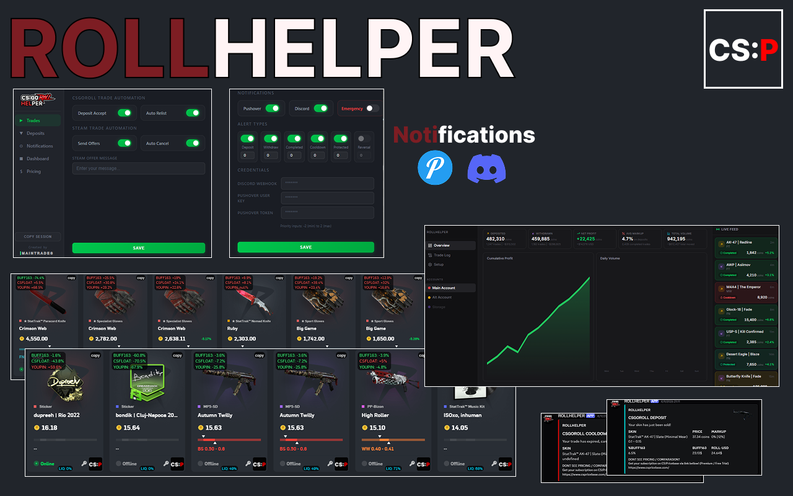

<div align="center">

<!-- Replace with your hero image -->


# RollHelper

**Open-source trading automation for CSGORoll**

[](https://www.gnu.org/licenses/gpl-3.0)
[](https://chrome.google.com/)
[](https://csgoroll.com/r/RLHLPR)
[](https://cspricebase.com)

</div>

---

RollHelper is a Chrome extension that automates deposit handling, trade management, and pricing lookups on CSGORoll. It is built for CS2 traders who want faster execution, real-time market data, and reliable notifications.

The extension connects to [CSPricebase](https://cspricebase.com) for live pricing across Buff163, CSFloat, and Youpin, and supports trade tracking through a personal dashboard.

---

## Changelog

### v1.4.5 — 2026-05-04
- Pricing overlay UI update + popup control for pricing settings
- version checks for updates in popup

### v1.4.4 — 2026-05-04
- Fixed bug which failed to init Websocket connection

### v1.4.3 — 2026-05-03

**Fixed**
- Added Switch to toggle automatic webapi token updater (popup)
- Added fallback for steam webapi token update errors via browser tabs api (current approach sometimes fails)
- Fixed bugs in popup (setting saves and other)
### v1.4 — 2026-04-11

**Added**
- Auto-relist deposits on cancel, expiry, or cooldown (with 35-min cooldown delay)
- Markup decay system — automatically reduces listing markup over time with configurable drop rate, interval, and floor (separate settings for craft and item-tier deposits)
- Deposit safeguard — blocks auto-accept when item value is underpriced vs. market by a configurable threshold (supports Buff, CSFloat, Youpin, or lowest-of-all)
- Retry with incremental backoff on all critical API calls (accept, relist, Steam offer, cancel)
- Redesigned popup with dedicated Trades, Deposits, Notifications, Dashboard, and Pricing tabs

**Fixed**
- Steam offer cancel 500 errors handled gracefully (already-inactive offers)
- User-initiated cancellations no longer trigger auto-relist

### v1.3 — 2026-04-01

**Added**
- Automatic Steam token updater
- Always-on store (items appear online without manual activity)
- Trade tracking dashboard via CSPricebase

---

## Table of Contents

- [Features](#features)
- [Installation](#installation)
- [Configuration](#configuration)
- [Pricing Integration](#pricing-integration)
- [Trade Tracking](#trade-tracking)
- [Notifications](#notifications)
- [Console Logging](#console-logging)
- [FAQ](#faq)
- [Custom Development](#custom-development)
- [License](#license)

---

## Features

### Trade Automation

| Feature                        | Description                                                                        |
|--------------------------------|------------------------------------------------------------------------------------|
| **Deposit Auto-Accept**        | Instantly accept incoming deposits. Optional safeguard blocks undervalued items.   |
| **Auto-Relist**                | Re-lists deposits that fail, get cancelled by withdrawer, expire, or hit cooldown. |
| **Steam Offer Sending**        | Sends Steam trade offers automatically with configurable message templates.        |
| **Steam Offer Auto-Cancel**    | Cancels pending Steam offers when the CSGORoll trade is cancelled.                 |
| **Steam Webapi Token Updater** | Automatically updates expired steam webapi token on background                     |

### Markup Decay

Automatically reduces deposit markup over time. Two independent profiles:

- **Craft Markup Decay** — for high-markup listings (above 15%)
- **Item Markup Decay** — for standard-markup listings

Each profile has its own drop percentage, interval (hours), and minimum floor. Decay is incremental: each interval drops the current markup by the configured amount until the floor is reached.

### Deposit Safeguard

Before auto-accepting a deposit, RollHelper compares the item's CSGORoll value against market prices from CSPricebase. If the item is undervalued beyond your configured threshold, the trade is blocked and you are notified.

Supported markets: Buff163, CSFloat, Youpin, or the lowest price across all three.

### Pricing Overlay

With a CSPricebase API key, RollHelper injects live market prices directly into CSGORoll deposit and withdraw pages. Console logs include full price breakdowns for every trade event.

### Notifications

Multi-channel notifications for trade events:

- **Pushover** — mobile push notifications with configurable priority levels (-2 to 2)
- **Discord** — webhook integration with formatted embeds
- **Emergency mode** — forces maximum priority on critical alerts (for pushover)

Supported events: deposits, withdrawals, completions, cooldowns, protected trades, reversals.

---

## Installation

### Prerequisites

- Google Chrome or any Chromium-based browser
- Active [CSGORoll](https://csgoroll.com/r/RLHLPR) account

### Install

**Option A — Git clone**

```bash
git clone https://github.com/0xM14N/rollhelper-extension.git
```

**Option B — Download ZIP**

Download from the [repository page](https://github.com/0xM14N/rollhelper-extension) and extract to a permanent location.

### Load into Chrome

1. Navigate to `chrome://extensions`
2. Enable **Developer mode** (top-right toggle)
3. Click **Load unpacked**
4. Select the `rollhelper-extension` folder

---

## Configuration

Click the RollHelper icon in your toolbar to open the settings popup.

### Trades Tab

- Toggle deposit auto-accept
- Toggle auto-relist on failed/cancelled/expired/cooldown trades
- Toggle automatic Steam offer sending
- Toggle Steam offer auto-cancel
- Set custom Steam offer message

### Deposits Tab

- **Craft Markup Decay** — enable/disable, set drop %, interval (hours), minimum %
- **Item Markup Decay** — same settings, independent from craft
- **Deposit Safeguard** — enable/disable, set threshold %, select reference market

### Notifications Tab

- Enable/disable Pushover and Discord channels
- Toggle individual alert types (deposit, withdraw, completed, cooldown, protected, reversal)
- Set per-event Pushover priority levels
- Enter Pushover user key, token, and Discord webhook URL
- Enable emergency mode for critical alerts

### Dashboard Tab

- Enter your CSPricebase tracking key
- Toggle trade tracking on/off

### Pricing Tab

- Enter your CSPricebase API key
- Toggle pricing overlay on/off

---

## Pricing Integration

RollHelper's pricing system is powered by [CSPricebase](https://cspricebase.com).

### Setup

1. Create an account at [cspricebase.com](https://cspricebase.com)
2. Subscribe to a plan that includes API access
3. Generate your API key from your [profile page](https://cspricebase.com/profile)
4. Paste the key into the **Pricing** tab in RollHelper settings

### What you get

- Live Buff163, CSFloat, and Youpin prices on deposit and withdraw pages
- Price comparisons in console logs for every trade event
- Markup calculations relative to market value
- Safeguard integration to block undervalued deposits

---

## Trade Tracking

Track all your CSGORoll trades into a personal dashboard on CSPricebase.

### Setup

1. Visit [cspricebase.com/trades/setup](https://cspricebase.com/trades/setup) and generate a free tracking key
2. Paste it into the **Dashboard** tab in RollHelper settings
3. Enable trade tracking

All deposit and withdrawal events are logged to your dashboard for historical analysis.

---

## Notifications

### Discord

1. Create a webhook in your Discord server: **Server Settings > Integrations > Webhooks**
2. Copy the webhook URL
3. Paste into the **Notifications** tab in RollHelper

### Pushover

1. Create an account at [pushover.net](https://pushover.net)
2. Install the Pushover app on your phone
3. Create an application token (name it "RollHelper")
4. Enter your user key and application token in the **Notifications** tab

Priority levels follow the Pushover scale: `-2` (silent) through `2` (emergency with repeat alerts).

---

## Console Logging

Open DevTools (`F12`) and filter to **Info** level for clean output. Every trade event is logged with full context:

```
[15:03] | [DEPOSIT]
StatTrak AK-47 | Slate (Minimal Wear)
41.82 coins | (12%) | 27.60$
[LIQ]: 84% | [MAX MARKUP]: 12%
[BUFF163]: +7.6%
[CSFLOAT]: +9.5%
[YOUPIN]: +6.2% (RATE: 0.66)
```

Decay events, relist actions, safeguard blocks, and Steam offer results are also logged with timestamps.

---

## FAQ

**Is RollHelper free?**
Yes. The extension is open-source under GPLv3. Pricing features require a CSPricebase subscription.

**Does this work on other trading sites?**
No. RollHelper is built specifically for CSGORoll.

**Does this violate CSGORoll's Terms of Service?**
RollHelper automates actions you would perform manually. Review CSGORoll's current ToS and use at your own discretion.

**How do I update?**
Git users: `git pull`. ZIP users: download the latest release and replace the folder, then reload in `chrome://extensions`.

**Pricing data not showing?**
Verify your CSPricebase API key is valid and your subscription is active.

**Steam offers not sending?**
Verify the extension has the necessary permissions and that your Steam access token is valid. Check the console for error details.

---

## Custom Development

Need features beyond what the public version offers? Custom builds are available, including:

- Advanced automation rules
- High-volume trading optimizations
- Custom notification logic
- Anything else your operation requires

Contact **maintrades** on Discord for inquiries.

---

## License

Licensed under the [GNU General Public License v3.0](LICENSE).

You are free to use, study, modify, and distribute this software. Derivative works must be distributed under the same license with source code disclosed.

---

<div align="center">

**[CSGORoll](https://csgoroll.com/r/RLHLPR)** | **[CSPricebase](https://cspricebase.com)** | **[GitHub](https://github.com/0xM14N/rollhelper-extension)**

By installing this extension, you agree to use referral code `RLHLPR` on CSGORoll.

Created by [maintrades](https://github.com/0xM14N)

</div>
